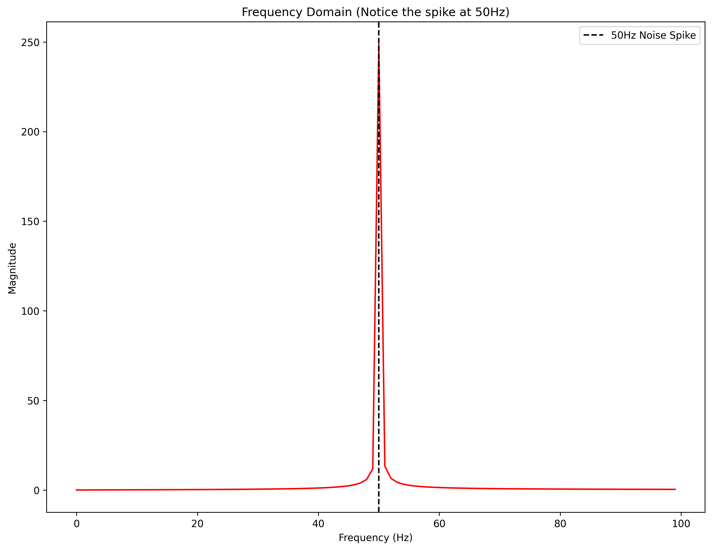
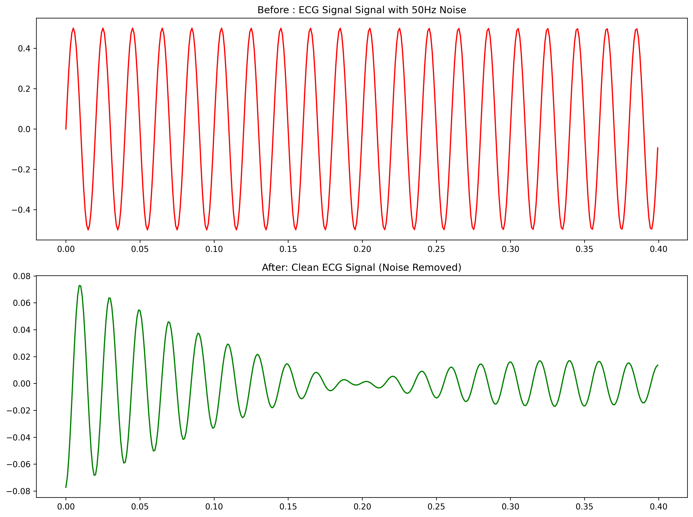

# ECG Signal Denoising Using Fast Fourier Transform (FFT)

## Project Overview

This project focuses on the digital processing of Electrocardiogram (ECG) signals to remove environmental noise, specifically 50Hz power-line interference.By converting signals from the **Time Domain** to the **Frequency Domain** , we can accurately filter out artifacts while preserving vital cardiac waves (P, QRS, and T).

## Project Structure

Following professional data engineering best practices:

- `data/raw/`: Original ECG datasets containing noise.
- `data/processed/`: Cleaned ECG signals after FFT filtering.
- `docs/`: Presentation slides and technical documentation.
- `src/validation/`: Modules to verify signal improvement.
- `notebooks/`: Interactive analysis of FFT and IFFT stages.

## Methodology

1. **Acquisition**: Collecting raw ECG data contaminated with noise.
2. **Transformation**: Applying **Fast Fourier Transform ($FFT$)** to identify noise spikes.
3. **Filtering**: Targeting the $50Hz$ frequency component for removal.
4. **Reconstruction**: Using **Inverse FFT ($IFFT$)** to restore the cleaned time-domain signal.

## Results: Before vs. After

The primary metric for success is the visual and mathematical clarity of the signal.

| **Signal Phase** | **Visual Output**                              | **Key Characteristic**                              |
| :--------------- | :--------------------------------------------- | :-------------------------------------------------- |
| **Raw ECG**      |      | High-frequency $50Hz$ noise distortion.             |
| **Filtered ECG** |  | Preserved cardiac morphology for medical diagnosis. |

## Impact & Applications

- **Clinical Diagnostics**: Assisting doctors in detecting arrhythmias with higher accuracy.
- **Wearable Tech**: Filtering motion artifacts in smartwatches.
- **AI Cardiology**: Providing clean data for machine learning heart attack predictions.

---

**Developed DSE Year 2 (RUPP)**.
